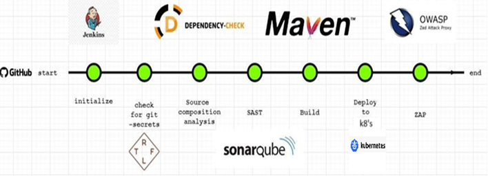

# Vulnerability Assessment using DevSecOps

## Overview

In our software development project, we've embraced the DevSecOps philosophy, where security isn't a separate phase but an integral part of our entire development process. A key aspect of this approach is achieving comprehensive vulnerability assessment to identify and mitigate potential security risks proactively. Here's how vulnerability assessment is woven into our project's DNA:

## 1. Early Detection and Prevention

- **Shift Left Philosophy:** Our DevSecOps pipeline embodies the "shift left" approach. This means we address security concerns at the earliest stages of development, from planning and design through to coding. By doing this, we catch vulnerabilities before they propagate to later, costlier stages.

## 2. Automated Security Scans

- **Check for Git Secrets:** At the very outset, we employ the Trufflehog tool within a Docker container. It thoroughly scans our Git repository for secrets and sensitive data. Any issues discovered are immediately flagged, promoting an environment of heightened security awareness.

- **Dependency Security Analysis:** We assess the security of our project's dependencies using OWASP Dependency-Check. This automated scan helps us identify vulnerabilities in third-party libraries and components. The results are archived, ensuring that we remain aware of and can address these issues.

## 3. Static Application Security Testing (SAST)

We go beyond just code quality checks. Through the power of SonarQube, our pipeline performs Static Application Security Testing (SAST). This step helps us uncover code-level vulnerabilities, security weaknesses, and compliance issues. The insights gained guide our development teams in making security-conscious decisions.

## 4. Dynamic Application Security Testing (DAST)

For our deployed application, we engage in Dynamic Application Security Testing using OWASP ZAP. This step simulates real-world attacks, seeking out vulnerabilities in the running application. The generated report offers an actionable list of items to address, ensuring our application remains resilient.

## 5. Collaboration and Knowledge Sharing

Collaboration among development, security, and operations teams is a fundamental aspect of our DevSecOps culture. By sharing knowledge and responsibilities, we collectively ensure that security is everyone's concern. This shared ownership fosters quicker vulnerability resolution and proactive risk mitigation.

## 6. Security in the CI/CD Pipeline

Security checks and scans are seamlessly integrated into our CI/CD pipeline. These automated checks occur at every crucial stage, from code commits to containerized deployment, ensuring that security is maintained at each juncture.

## 7. Continuous Improvement

Our DevSecOps approach is a journey, not a destination. We constantly learn from security incidents, vulnerability assessments, and industry best practices. This ongoing process of improvement allows us to adapt swiftly to new threats and challenges.

## 8. Secure Software, Always

By embedding vulnerability assessment into our DevSecOps pipeline, we maintain a robust stance against potential security threats. Security isn't an afterthought; it's a core part of our software development process, leading to safer, more reliable software releases.

## Conclusion

Our DevSecOps approach empowers us to identify and address vulnerabilities at every turn, ensuring that our software remains secure, and our users' data is safeguarded. By embracing security as a continuous process, we fortify our commitment to delivering high-quality, secure software that our users can trust.
